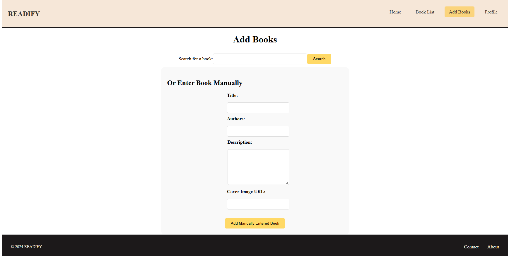
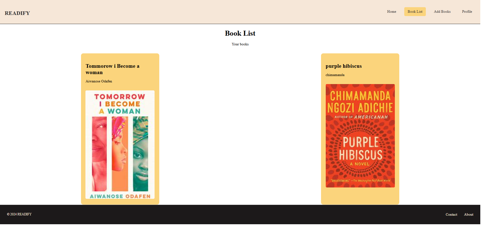

# Readify
[Landing page screenshot](./homePage.png)

Welcome to **Readify**, a book tracking web application that allows you to manage your book collection effortlessly. With Readify, you can search for books, manually add them, and keep track of your reading list. The application is built using Flask for the backend and React for the frontend, providing a seamless and interactive user experience.

## Table of Contents

- [Features](#features)
- [Getting Started](#getting-started)
  - [Prerequisites](#prerequisites)
  - [Installation](#installation)
  - [Running the Application](#running-the-application)
- [Pages Overview](#pages-overview)
  - [Add Books Page](#add-items-page)
  - [BookList Page](#booklist-page)
  - [Profile Page](#profile-page)
- [Screenshots](#screenshots)

## Features

- **Search and Add Books**: Search for books and add them to your collection.
- **Manual Entry**: Add books manually by filling in the title, authors, description, and image.
- **User Profile**: Manage your profile details, including updating your bio, password, and profile image.
- **BookList**: View your entire book collection and search through it.


## Getting Started

### Prerequisites

- **Node.js version 18** (for the frontend)
- **Python 3.x** (for the backend)
- **Flask** and **React** libraries

### Installation

1. **Clone the Repository:**

    ```bash
    git clone https://github.com/Zeezbaba/Readify.git
    cd Readify
    ```

2. **Install Backend Dependencies:**

    Navigate to the backend folder and install the Python dependencies.

    ```bash
    cd backend
    python3 -m venv venv
    source venv/bin/activate
    pip install -r requirements.txt
    ```

3. **Install Frontend Dependencies:**

    Navigate to the frontend folder and install the Node.js dependencies.

    ```bash
    cd ../frontend
    npm install
    ```

### Running the Application

1. **Run the Backend:**

    In the backend directory, start the Flask server.

    ```bash
    flask run
    ```

2. **Run the Frontend:**

    In the frontend directory, start the React development server.

    ```bash
    npm start
    ```

3. **Access the Application:**

    Open your browser and navigate to `http://localhost:3000` to access the application.

## Pages Overview

### Add Books Page

This page allows users to search for books via the OpenLibrary API and add them to their collection. It also includes a manual entry section for adding books by entering the title, author(s), description, and image URL.



### BookList Page

The BookList page displays all books added to the user's collection.




